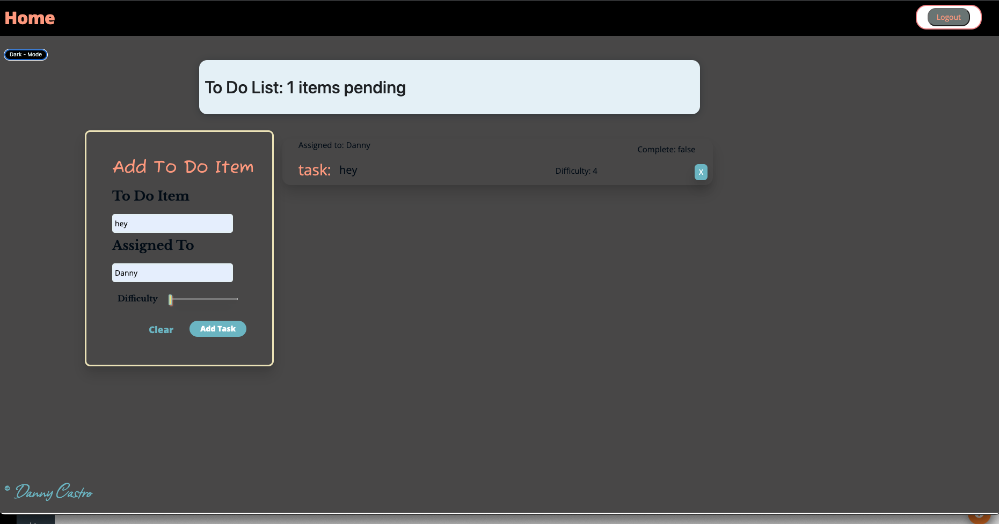

# LAB - 32

## Deployment Test

Author: Danny Castro

- tests report
- front-end

### Setup

`.env` requirements: (none)

- PORT - n/a

### Running the app

npm start

- Endpoint: `/` || `/todo`

Returns

