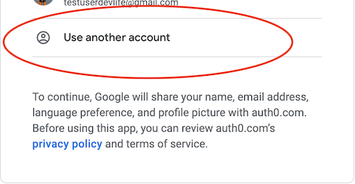

# LAB - 34

## Deployment Test

Author: Danny Castro

- tests report

- [netlify](https://dannys-todo-app.netlify.app)

### Setup

`.env` requirements: (none)

- PORT - n/a

### Running the app

npm start

- Endpoint: `/`

### Test app

To test the Admin abilities,fist:

1.  click Continue with google

    

2.  then click on Use another account

    

3.  after use email and password provided to log in.

- `email:` testUserDevLife@gmail.com
- `password:` test2022

Use your own email to log in and view the app as a "user" with only `read` capabilities.

Returns

